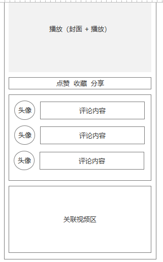
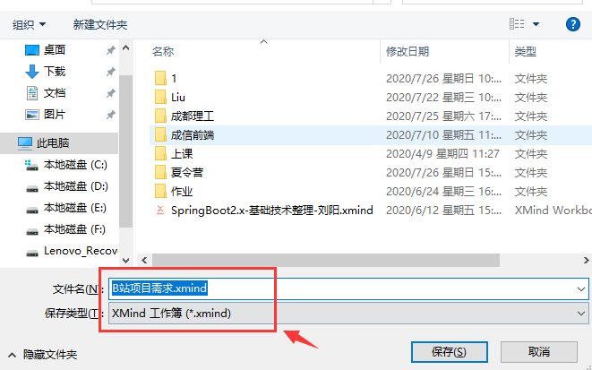

学习周期
	7月26~8月4日

学习内容
	1. 统一讲授基础的技术（前端 + 后端）
	2. 暂定时间 7月30日 结束基础技术讲解
	3. 7月31日 开始进入到团队项目

整个B站项目 - 基于B站小程序视频播放平台
	1. 前端架构 - 小程序技术支撑
		1）完成界面开发
		2）完成数据渲染
		3）动态效果设计

	2. 后端架构 - Java技术支撑
		1）提供前端小程序所需要的数据接口
		2）提供一个管理数据的平台
			a：统计数据 - 今天又多少人访问我们小程序
			b：新增视频 - 难道请数据库管理员（DBA）进行数据添加？？？

今日头条 - 聚会类型平台 - 用户群体面向（个人；媒体）
	1. 自媒体 - 新闻；抖音；视频
	2. 类似知了堂视频平台管理端

思考：
	1. 尽量满足用户需求 - 开发人员职责
	2. 后端同学需不需开发一个后端数据管理中心？？？

项目去学习技术
	1. 需求分析 - 功能（团队）
		1）前端
			a：主页 - 提供怎样的功能（需要多少数据 - 参数）
			b：分类 - 提供怎样的功能（需要多少数据 - 参数）
			c：个人 - 提供怎样的功能（需要多少数据 - 参数）
			d：视频 - 播放页面（需要多少数据 - 参数）
		结论：找后端开发人员给我数据

		2）后端
			a：数据库怎么设计
			b：视频主页 - 提供怎样的功能
			c：发表视频 - 提供怎样的功能
			d：内容管理 - 提供怎样的功能
			e：评论管理 - 提供怎样的功能
			f：视频数据 - 提供怎样的功能
	
	产出内容：需求分析 - 思维导图
	
	2. 原型图设计 - axure 工具
	
	3. 开发文档设计 - 前端和后端开发规范
		1）设计接口文档
		2）如下非常重要内容
			a：接口地址 - 网络地址 - 访问地址，则可以获取服务器上数据
			b：接口功能
			c：请求参数
			d：请求方式
			e：返回数据类型
			f：返回数据结果

具体的接口文档格式，请参考上课word文档

任务 - 团队合作任务

- 梳理项目需求，提交文件格式 思维导入

- 完成原型图设计，提交线框图的原型
  1. 前端界面 - 线框图
  2. 后端界面 - 线框图
- 完成接口开发文档，提交word文档

工具

- axure - 原型图
- typora - markdown工具
- xmind - 思维导图

作业提交规范：

- 压缩包形式
- 1组-20200726.zip 或 1组-20200726.rar

