# 1.开发内容

- 提供接口数据给前端
- 开发自己管理平台

# 2.后端环境

- JDK8+；学习使用的开发环境
- Apache-Tomcat8/9，Web服务器，提供`Http/Https`协议服务
- MySQL5数据库；客户端工具（SQLyog / Navicat）；数据库设计建模工具（PowerDesigner）
- Maven工具 - 项目构建工具
- 远程源码管理仓库 + SVN（ *TortoiseSVN* ）
- 开发工具 - IDEA

# 3.Maven

*Maven*项目对象模型(POM)，可以通过一小段<u>**描述信息来管理项目的构建**</u>，报告和文档的项目管理工具软件

## 3.1 Maven环境

Maven版本 - 3.5 / 3.6

配置maven环境变量，添加 `MAVEN_HOME`

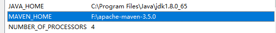

配置path环境变量，添加maven的bin目录

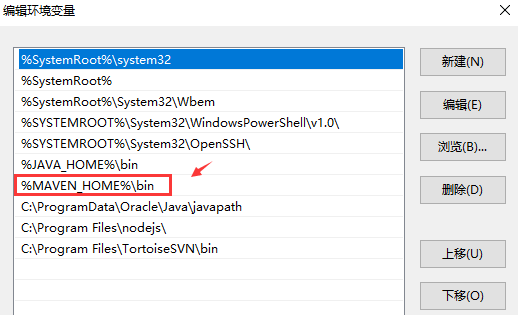

测试 maven 环境

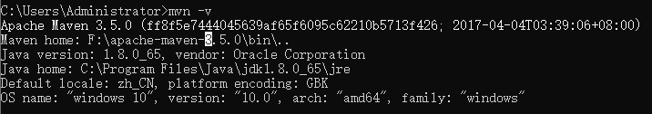

## 3.2 Maven仓库

仓库里面存储关于我们开发相关的程序包。<u>**好处**</u>在于创建项目时候可以不用 `ctrl+c` 和 `ctrl+v` 进行程序包的复制；<u>**另一个好处追加依赖包**</u>，例如：一个项目里面需要 A.jar，但是A.jar --> B.jar。所以项目需要两个程序包，则maven可以自动把所需要第三方依赖包加入到项目里面

仓库：本地仓库 和 远程仓库

本地仓库默认路径 `.m2` 的目录，则可以根据自己的情况修改本地仓库路径

## 3.3 阿里云镜像

配置阿里云镜像，可以加速程序下载。注意去修改 maven 目录下 `conf/settings.xml`

```xml
<mirrors>
    <mirror>
      <id>alimaven</id> 
      <name>aliyun maven</name> 
      <url>http://maven.aliyun.com/nexus/content/groups/public/</url> 
      <mirrorOf>central</mirrorOf> 
    </mirror>
</mirrors>
```

## 3.4 创建maven项目

`maven-webapp` 项目支持web服务器开发

### 3.4.1 搭建maven-webapp骨架

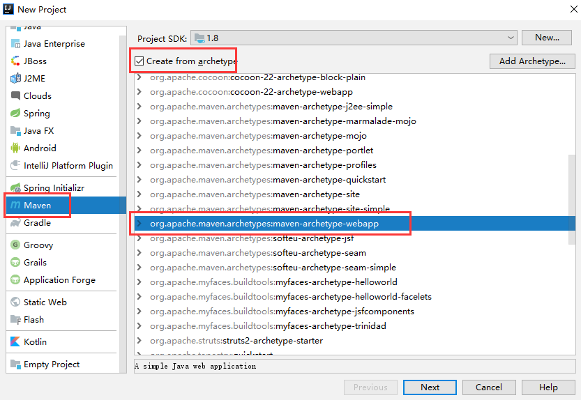

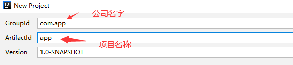

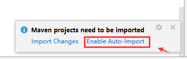

### 3.4.2 项目目录结构

`maven-webapp` 工程结构

- src/main/java：源码目录
- src/main/webapp：web资源目录
- src/test/java：测试代码目录

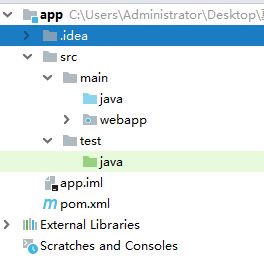

### 3.4.3 配置tomcat

第一步：加载tomcat模板

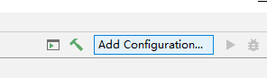

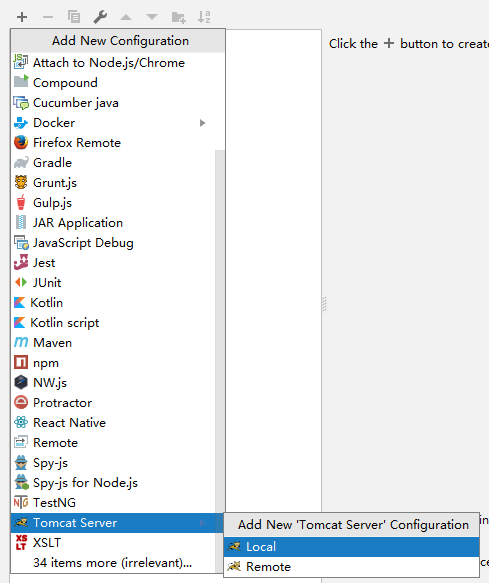

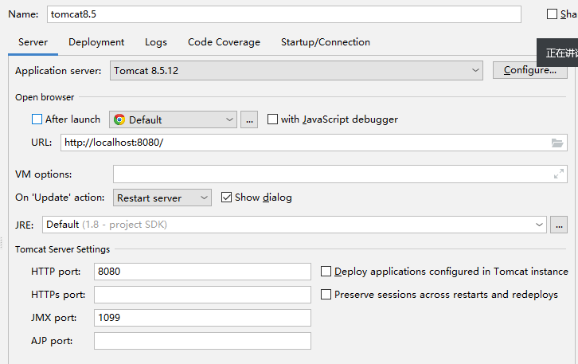

第二步：创建项目artifact

将我们项目能够挂载tomcat里面

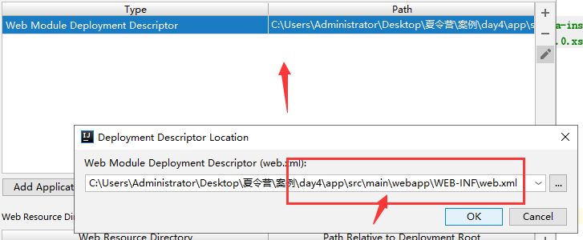

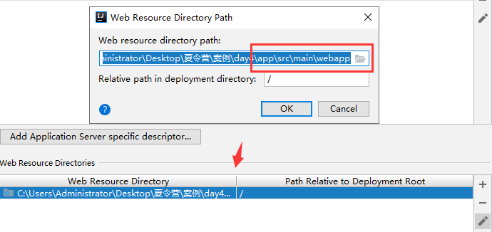

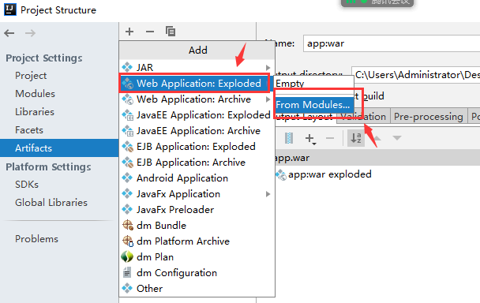

### 3.4.4 创建servlet

- Servlet是Java服务器端一个程序，支持接口开发。但是我们创建Java类需要继承`HttpServlet`

- 需要定义接口地址 `@WebServlet("/hello")`
- 创建对应请求方法 `doGet` 和 `doPost`

```xml
    <dependency>
      <groupId>javax.servlet</groupId>
      <artifactId>javax.servlet-api</artifactId>
      <version>3.1.0</version>
    </dependency>
```

```java
package com.app.controller.web;

import javax.servlet.ServletException;
import javax.servlet.annotation.WebServlet;
import javax.servlet.http.HttpServlet;
import javax.servlet.http.HttpServletRequest;
import javax.servlet.http.HttpServletResponse;
import java.io.IOException;

@WebServlet("/hello")
public class HelloController extends HttpServlet {
    @Override
    protected void doGet(HttpServletRequest req, HttpServletResponse resp) throws ServletException, IOException {
        System.out.println("---HelloController---");
    }
}
```

