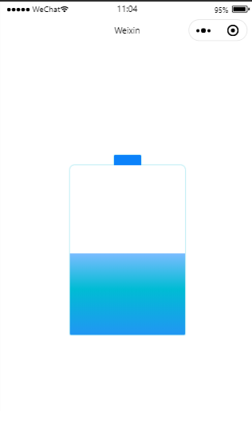
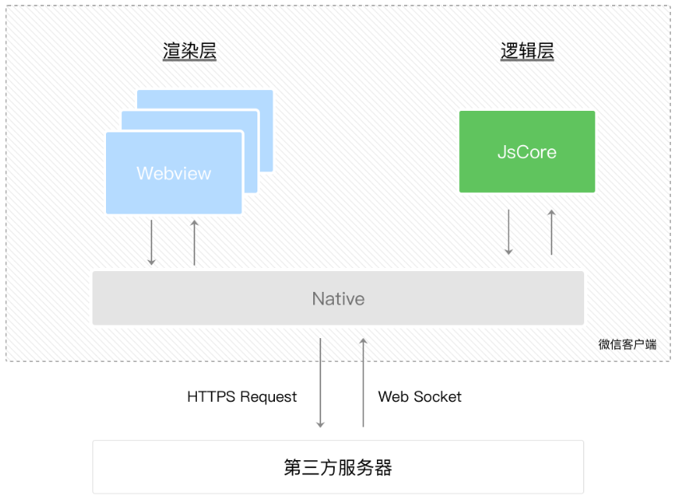
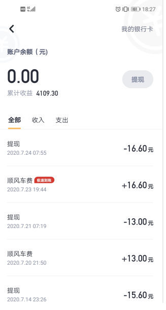
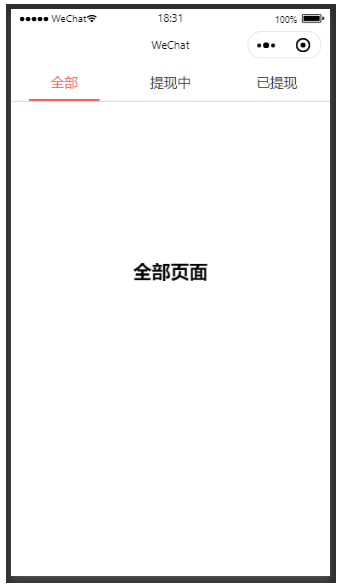
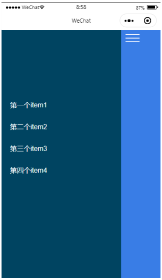
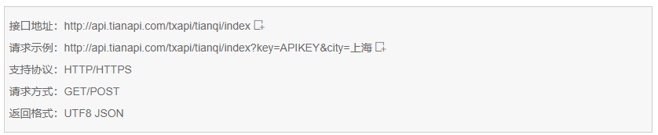
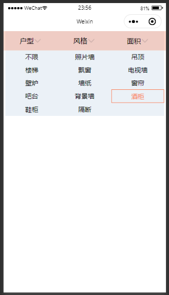
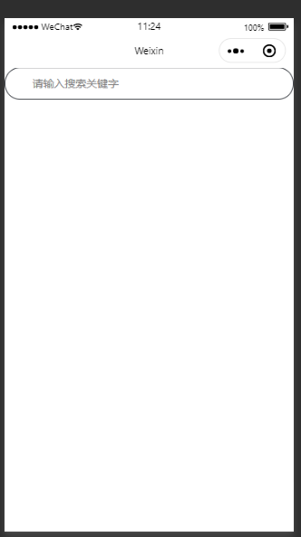

# 1.学习内容

- 巩固小程序样式应用
- JavaScript入门 - 小程序
- 小程序开发 - 实战

# 2.小程序样式应用

- 小程序样式 - 关联文件wxss
- 场景应用 - 小程序手机充电特效
- 介绍一下小程序里面的组件（标签）
  1. view：容器组件，类似div
  2. image，图片组件
  3. text，文本组件



```xml
<view class='container'>
  <view class="battery"></view>
</view>
```

```css
/* 设置一个页面样式 */
page {
  width: 100%;
  height: 100%;
  display: flex;
}

/* 电池充电壳 - 容器 */
.container {
  position: relative;
  width: 340rpx;
  height: 500rpx;
  margin: auto;
}

/* 存储电量 - 容器*/
.battery {
  position: absolute;
  left: 0;
  top: 0;
  width: 100%;
  height: 100%;
  border-radius: 15rpx 15rpx 5rpx 5rpx;
  background-color: #fff;
  filter: drop-shadow(0 1rpx 3rpx rgba(1,188,213, .82));
}

/* 电池正极 */
.battery::before {
  content: '';
  position: absolute;
  left: 50%;
  top: 0;
  width: 80rpx;
  height: 30rpx;
  background-color: rgba(2,119,253, .88);
  border-radius: 5rpx 5rpx 0 0;
  transform: translate(-50%, -30rpx);
}

/* 电量样式 */
.battery::after {
  content: '';
  position: absolute;
  left: 0;
  right: 0;
  bottom: 0;
  top: 80%;
  border-radius: 0 0 5rpx 5rpx;
  background: linear-gradient(to bottom, #7abcff 0%, #00BCD4 44%, #2196F3 100%);
  animation: chong 6s linear infinite;
}

@keyframes chong {
  95%{
    top: 5%;
    border-radius: 0 0 5rpx 5rpx;
  }100%{
    top: 0;
    border-radius: 15rpx 15rpx 5rpx 5rpx;
  }
}
```

# 3.小程序 - JS

## 3.1 JS 介绍

JavaScript是一种属于网络的高级脚本语言,已经被广泛用于Web应用开发,常用来为网页添加各式各样的动态功能,为用户提供更流畅美观的浏览效果。通常JavaScript脚本是通过嵌入在HTML中来实现自身的功能的

JavaScript的标准是[ECMAScript](https://baike.baidu.com/item/ECMAScript/1889420) 。截至 2012 年，所有[浏览器](https://baike.baidu.com/item/浏览器/213911)都完整的支持ECMAScript 5.1，旧版本的浏览器至少支持ECMAScript 3 标准。2015年6月17日，[ECMA](https://baike.baidu.com/item/ECMA/1499618)国际组织发布了[ECMAScript](https://baike.baidu.com/item/ECMAScript/1889420)的第六版，该版本正式名称为 ECMAScript 2015，<u>**但通常被称为ECMAScript 6 或者ES6**</u>


> ECMAScript 6(ES6) 目前基本成为业界标准，它的普及速度比 ES5 要快很多，主要原因是现代浏览器对 ES6 的支持相当迅速，尤其是 Chrome 和 Firefox 浏览器，已经支持 ES6 中绝大多数的特性

## 3.2 ES6 新语法

- 不一样变量声明：const 和 let

ES6推荐使用let定义局部变量

```js
var x = '全局变量';
{
  let x = '局部变量';
  console.log(x); // 局部变量
}
console.log(x); // 全局变量
```

const表示声明常量，两者都为块级作用域；const 声明的变量都会被认为是常量，意思就是它的值被设置完成后就不能再修改了

```js
const a = 1
a = 0 //报错
```

- 模板字符串

ES6之前处理字符串：通过`\` 或 `+` 来构建模板

```js
$("body").html("This demonstrates the output of HTML \
content to the page, including student's\
" + name + ", " + seatNumber + ", " + sex + " and so on.");
```

ES6的字符串应用

1. 基本的字符串格式化。将表达式嵌入字符串中进行拼接。用${}来界定
2. ES6反引号(``)直接搞定

```js
$("body").html(`This demonstrates the output of HTML content to the page, 
including student's ${name}, ${seatNumber}, ${sex} and so on.`);
```

- 箭头函数

> ES6 中，箭头函数就是函数的一种简写形式，使用括号包裹参数，跟随一个 =>，紧接着是函数体

箭头函数三大特点

1. 不需要function关键字来创建函数
2. 省略`return`关键字
3. 继承当前上下文的this关键字

```js
// ES5
var add = function (a, b) {
    return a + b;
};
// 使用ES6箭头函数
var add = (a, b) => a + b;

// ES5
[1,2,3].map((function(x){
    return x + 1;
}).bind(this));
    
// 使用ES6箭头函数
[1,2,3].map(x => x + 1);
```

- 函数的参数默认值

```js
// ES6之前，当未传入参数时，text = 'default'；
function printText(text) {
    text = text || 'default';
    console.log(text);
}

// ES6；
function printText(text = 'default') {
    console.log(text);
}

printText('hello'); // hello
printText();// default
```

- for循环

for...of 用于遍历一个迭代器，如数组

```js
let letters = ['a', 'b', 'c'];
letters.size = 3;
for (let letter of letters) {
  console.log(letter);
}
// 结果: a, b, c
```

for...in 用来遍历对象中的属性：

```js
 let stus = ["Sam", "22", "男"];
 for (let stu in stus) {
   console.log(stus[stu]);
  }
// 结果: Sam, 22, 男
```

- 对象超类

ES6 允许在对象中使用 super 方法

```js
var parent = {
  foo() {
    console.log("Hello from the Parent");
  }
}
 
var child = {
  foo() {
    super.foo();
    console.log("Hello from the Child");
  }
}
 
Object.setPrototypeOf(child, parent);
child.foo(); // Hello from the Parent
             // Hello from the Child
```

## 3.3 小程序中的JS原理

- 小程序JS的开发，完全采用ECMAScript语法标准来执行的。所以，大家学习小程序开发之前一定要把JavaScript学好

- 小程序中<u>**渲染层和逻辑层**</u>是理解小程序实现动态数据交互，以及如何操作网页标签和样式的核心
  1. 首先，我们来简单了解下小程序的运行环境。小程序的运行环境分成渲染层和逻辑层，其中 WXML 模板和 WXSS 样式工作在渲染层，<u>**JS 脚本工作在逻辑层**</u>。
  2. 小程序的渲染层和逻辑层分别由2个线程管理：渲染层的界面使用了WebView 进行渲染；逻辑层采用JsCore线程运行JS脚本。一个小程序存在多个界面，所以渲染层存在多个WebView线程，这两个线程的通信会经由微信客户端（下文中也会采用Native来代指微信客户端）做中转，逻辑层发送网络请求也经由Native转发，小程序的通信模型下图所示



## 3.4 小程序运行机制

### 3.4.1 前台/后台

小程序启动后，界面被展示给用户，此时小程序处于**前台**状态。

当用户点击右上角胶囊按钮关闭小程序，或者按了设备 Home 键离开微信时，小程序并没有完全终止运行，而是进入了**后台**状态，小程序还可以运行一小段时间。

当用户再次进入微信或再次打开小程序，小程序又会从后台进入**前台**。但如果用户很久没有再进入小程序，或者系统资源紧张，小程序可能被**销毁**，即完全终止运行。

### 3.4.2 小程序启动

这样，小程序启动可以分为两种情况，一种是**冷启动**，一种是**热启动**。

- 冷启动：如果用户首次打开，或小程序销毁后被用户再次打开，此时小程序需要重新加载启动，即冷启动。
- 热启动：如果用户已经打开过某小程序，然后在一定时间内再次打开该小程序，此时小程序并未被销毁，只是从后台状态进入前台状态，这个过程就是热启动。

### 3.4.3 小程序销毁时机

通常，只有当小程序进入后台一定时间，或者系统资源占用过高，才会被销毁。具体而言包括以下几种情形：

- 当小程序进入后台，可以维持一小段时间的运行状态，如果这段时间内都未进入前台，小程序会被销毁。
- 当小程序占用系统资源过高，可能会被系统销毁或被微信客户端主动回收。
  - 在 iOS 上，当微信客户端在一定时间间隔内连续收到系统内存告警时，会根据一定的策略，主动销毁小程序，并提示用户 「运行内存不足，请重新打开该小程序」。具体策略会持续进行调整优化。
  - 建议小程序在必要时使用 [wx.onMemoryWarning](https://developers.weixin.qq.com/miniprogram/dev/api/device/performance/wx.onMemoryWarning.html) 监听内存告警事件，进行必要的内存清理。

## 3.5 小程序生命周期

**以下内容你不需要立马完全弄明白，不过以后它会有帮助**


# 4.小程序-实战

## 4.1 余额提现-界面



案例界面：



涉及到技术

- JS事件，如何在小程序上定义函数，让函数绑定小程序上事件
- 小程序事件参数传递，如何能够接收页面（渲染层）传递过来的参数（逻辑层）
- 目标达成：JS控制组件 + 组件样式

```xml
<view class='swiper-tab'>
  <view class="swiper-tab-item {{currentTab == 0 ? 'active': ''}}" data-current='0' bindtap='clickTab'>全部</view>
  <view class="swiper-tab-item {{currentTab == 1 ? 'active': ''}}" data-current='1' bindtap='clickTab'>提现中</view>
  <view class="swiper-tab-item {{currentTab == 2 ? 'active': ''}}" data-current='2' bindtap='clickTab'>已提现</view>
</view>

<swiper duration="300" current="{{currentTab}}" bindchange='swiperTab'>
  <swiper-item>
    <view>全部页面</view>
  </swiper-item>
  <swiper-item>
    <view>提现中页面</view>
  </swiper-item>
  <swiper-item>
    <view>已提现页面</view>
  </swiper-item>
</swiper>
```

```css
.swiper-tab {
  width: 100%;
  height: 88rpx;
  border-bottom: 2rpx solid #ccc;
  text-align: center;
  line-height: 88rpx;
  display: flex;
  flex-flow: row;
  justify-content: space-around;
}

.swiper-tab-item {
  width: 22%;
  color: #434343;
}

.active {
  color: #F65959;
  border-bottom: 4rpx solid #F65959;
}

swiper {
  height: 800rpx;
  line-height: 800rpx;
  font-weight: bold;
  font-size: 45rpx;
  text-align: center;
}
```

```js
// pages/aliplay/aliplay.js
Page({

  /**
   * 页面的初始数据
   */
  data: {
    'currentTab': 0
  },

  // 滑块左右滑动会触发此事件
  swiperTab: function(e) {
    let _this = this;
    _this.setData({  // 如果要去修改 data 里面变量 currentTab，则需使用 setData() 函数
      currentTab: e.detail.current // 给变量currentTab进行重新赋值
    });
  },

  // 卡片点击事件
  clickTab: function(e) {
    // 当点中卡片需要去改变 currentTab 变量
    // currentTab 变量的值怎么来
    // e.target.dataset.current 相当于 <view data-current='0'></view>
    let _this = this;
    if(_this.data.currentTab === e.target.dataset.current) {
      return false;
    } else {
      _this.setData({
        currentTab: e.target.dataset.current
      })
    }
  },

  /**
   * 生命周期函数--监听页面加载
   */
  onLoad: function (options) {

  },

  /**
   * 生命周期函数--监听页面初次渲染完成
   */
  onReady: function () {

  },

  /**
   * 生命周期函数--监听页面显示
   */
  onShow: function () {

  },

  /**
   * 生命周期函数--监听页面隐藏
   */
  onHide: function () {

  },

  /**
   * 生命周期函数--监听页面卸载
   */
  onUnload: function () {

  },

  /**
   * 页面相关事件处理函数--监听用户下拉动作
   */
  onPullDownRefresh: function () {

  },

  /**
   * 页面上拉触底事件的处理函数
   */
  onReachBottom: function () {

  },

  /**
   * 用户点击右上角分享
   */
  onShareAppMessage: function () {

  }
})
```

## 4.2 侧栏滑动



目标达成：

1. JS原理：渲染层 与 逻辑层 交互
2. 事件用法能够更加熟练
   - 如何获取js里面变量 `this.data.变量名`
   - 如何设置js里面变量 `this.setData(...)`
3. 页面与js数据交互（传递）
   - H5中data属性  `<view data-index='100'></view>`
   - 增加一个事件 `<view data-index='100' bindtap='show'>`
   - 在定义show函数时候去委派一个事件对象 `function(e) {}`，`e.target.dataset.index`

```xml
<!-- 容器 -->
<view class='page'>

  <!-- 左侧栏 - 容器  -->
	<view class="page-bottom">
		<view class="page-content">
			<view class="wc">
				<text>第一个item-1</text>
			</view>
			<view class="wc">
				<text>第二个item-2</text>
			</view>
			<view class="wc">
				<text>第三个item-3</text>
			</view>
			<view class="wc">
				<text>第四个item-4</text>
			</view>
		</view>
	</view>

  <!-- 右侧栏 - 容器 -->
	<view class="page-top {{open ? 'c-state1': ''}}">
		<image src="/images/btn.png" bindtap="tap_ch"></image>
	</view>
</view>
```

```css
page, .page {
  height: 100%;
}

.page-bottom {
  height: 100%;
  width: 750rpx;
  position: fixed;
  z-index: 0;
  background-color: rgb(0, 68, 97);
}

.page-content {
  padding-top: 300rpx;
}

.wc {
  color: #fff;
  padding: 30rpx 0 30rpx 40rpx;
}

.page-top {
  height: 100%;
  position: fixed;
  width: 750rpx;
  z-index: 0;
  background-color: rgb(57, 125, 230);
  transition: 0.4s all ease;
}

.page-top image {
  position: absolute;
  width: 68rpx;
  height: 38rpx;
  left: 20rpx;
  top: 20rpx;
}

.c-state1 {
  transform: rotate(0deg) scale(1) translate(75%, 0%);
}
```

```js
// pages/side/side.js
Page({

  /**
   * 页面的初始数据
   */
  data: {
    open: false
  },

  tap_ch: function(e) {
    // 点击控制样式的变化
    // this 当前页面的对象，包含：js里面函数，变量名，内置方法 setData()
    let _this = this;
    if(_this.data.open) {
      _this.setData({
        open: false // 关闭状态
      });
    } else {
      _this.setData({
        open: true // 打开状态
      });
    }
  },

  /**
   * 生命周期函数--监听页面加载
   */
  onLoad: function (options) {

  },

  /**
   * 生命周期函数--监听页面初次渲染完成
   */
  onReady: function () {

  },

  /**
   * 生命周期函数--监听页面显示
   */
  onShow: function () {

  },

  /**
   * 生命周期函数--监听页面隐藏
   */
  onHide: function () {

  },

  /**
   * 生命周期函数--监听页面卸载
   */
  onUnload: function () {

  },

  /**
   * 页面相关事件处理函数--监听用户下拉动作
   */
  onPullDownRefresh: function () {

  },

  /**
   * 页面上拉触底事件的处理函数
   */
  onReachBottom: function () {

  },

  /**
   * 用户点击右上角分享
   */
  onShareAppMessage: function () {

  }
})
```

## 4.3 天气预报

### 4.3.1 目标达成

- 理解第三方服务器概念 - 作用
- 接口作用：提供数据；如何分析它们数据格式；理解请求参数含义
- 学会使用小程序的网络请求 API 来调用第三方服务器的接口

### 4.3.2 实现步骤

第一步：寻找提供天气预报第三方服务器，分析服务器提供的数据接口格式

- 接口就是网络地址，采用天行数据API接口
- 请求参数，告诉服务器要想获取具体的数据是什么
- 返回数据

第二步：通过微信小程序<u>**网络请求组件**</u>，能够拉取第三方服务器发送数据

- `wx.request` 函数请求网络数据
- 根据接口信息，编写如下代码 - 代码样例



```js
wx.request({
    url: 'http://api.tianapi.com/txapi/tianqi/index?key=xxx&city=成都',
    method: 'GET',
    dataType: 'json',
    success: function(e) {}
});
```

第三步：设计天气预报界面，然后将数据渲染到界面里面

1. 解析数据 - 天行api返回数据是一个数组 `newslist`
2. 数据绑定

```js
// pages/weather/weather.js
Page({

  /**
   * 页面的初始数据
   */
  data: {
    weatherlist: [] // 给wxml传递数据
  },

  /**
   * 生命周期函数--监听页面加载
   */
  onLoad: function (options) {
    var _this = this;
    wx.request({
      url: 'http://api.tianapi.com/txapi/tianqi/index?key=ed1394ce936a5526c70fea58875538e0&city=成都',
      method: 'GET',
      dataType: 'json', // 小写的json
      success: function(e) {
        // e.newslist 返回存储天气信息数据
        // let newslist 自己定义的变量, 接收 e.newslist 里面数据
        let newslist = e.data.newslist;
        _this.setData({
          weatherlist: newslist
        });
      }
    })
  },

  /**
   * 生命周期函数--监听页面初次渲染完成
   */
  onReady: function () {

  },

  /**
   * 生命周期函数--监听页面显示
   */
  onShow: function () {

  },

  /**
   * 生命周期函数--监听页面隐藏
   */
  onHide: function () {

  },

  /**
   * 生命周期函数--监听页面卸载
   */
  onUnload: function () {

  },

  /**
   * 页面相关事件处理函数--监听用户下拉动作
   */
  onPullDownRefresh: function () {

  },

  /**
   * 页面上拉触底事件的处理函数
   */
  onReachBottom: function () {

  },

  /**
   * 用户点击右上角分享
   */
  onShareAppMessage: function () {

  }
})
```

### 4.3.3 JSON数据

*JSON*(JavaScript Object Notation, JS 对象简谱) 是一种轻量级的数据交换格式。它基于 ECMAScript (欧洲计算机协会制定的js规范)的一个子集，采用完全独立于编程语言的文本格式来存储和表示数据

- 数据交换格式：数据传递方式
- ECMAScript 一个子集，JSON数据解析可以使用JS语言实现

JSON数据格式分类

- 对象数据格式，采用键值对格式存储数据

```json
{key:value, key:value, key:value}
```

- 集合（列表 / 数组）数据格式，采用数组形式存储数据

```json
[object, object, object]
```

JSON数据解析

```js
var a = {'area':'成都', 'date':'2020-07-29'} // 对象
var b = a.area; // 对象.key
var c = a.date; // 对象.key

var d = [{'area':'成都', 'date':'2020-07-29'}, {'area':'南充', 'date':'2020-07-29'}] //集合
for(i = 0; i < d.length; i++) {
    var e = d[i].area;
    var f = d[i].date;
}
```

## 4.4 下拉选项



```xml
<view class="jiaju-nav">
  <view class="jiaju-item" wx:for='{{tabTxt}}' wx:key='' data-index='{{index}}' bindtap='filterTab'>
    <text>{{item}}</text><image src="/images/arrow.png"></image>
  </view>
</view>

<view class="jiaju-select" hidden="{{tab}}">
  <text class="jiaju-select-item">不限</text>
  <text class="jiaju-select-item">照片墙</text>
  <text class="jiaju-select-item">吊顶</text>
  <text class="jiaju-select-item">楼梯</text>
  <text class="jiaju-select-item">飘窗</text>
  <text class="jiaju-select-item">电视墙</text>
  <text class="jiaju-select-item">壁炉</text>
  <text class="jiaju-select-item">墙纸</text>
  <text class="jiaju-select-item">窗帘</text>
  <text class="jiaju-select-item">吧台</text>
  <text class="jiaju-select-item">背景墙</text>
  <text class="jiaju-select-item active">酒柜</text>
  <text class="jiaju-select-item">鞋柜</text>
  <text class="jiaju-select-item">隔断</text>
  <text class="jiaju-select-item"></text>
</view>
```

```css
.jiaju-nav {
  width: 100%;
  height: 90rpx;
  line-height: 90rpx;
  border-bottom: 1px solid #eee;
  position: fixed;
  top: 0;
  left: 0;
  display: flex;
  background-color: rgba(250,118,79, 0.3);
}

.jiaju-item {
  width: 33%;
  height: 90rpx;
  display: flex;
  justify-content: center;
  align-items: center;
}

.jiaju-item > image {
  width: 30rpx;
  height: 30rpx;
  margin-left: 5rpx;
}

.jiaju-select {
  padding-top: 90rpx;
  margin: 0 auto;
  width: 98%;
  height: auto;
  display: flex;
  flex-wrap: wrap;
  justify-content: space-around;
  background-color: rgba(190,210,230, .3);
}

.jiaju-select-item {
  width: 33%;
  height: 60rpx;
  text-align: center;
  line-height: 60rpx;
  font-size: 30rpx;
}

.active {
  color: rgb(250,118,79);
  border: 1rpx solid rgb(250,118,79);
}
```

```js
// pages/jiaju/jiaju.js
Page({

  /**
   * 页面的初始数据
   */
  data: {
    tabTxt: ['户型', '风格', '面积'],
    tab: true
  },

  filterTab: function() {
    let _this = this;
    if(_this.data.tab) {
      _this.setData({
        tab: false
      });
    } else {
      _this.setData({
        tab: true
      });
    }
  },

  /**
   * 生命周期函数--监听页面加载
   */
  onLoad: function (options) {

  },

  /**
   * 生命周期函数--监听页面初次渲染完成
   */
  onReady: function () {

  },

  /**
   * 生命周期函数--监听页面显示
   */
  onShow: function () {

  },

  /**
   * 生命周期函数--监听页面隐藏
   */
  onHide: function () {

  },

  /**
   * 生命周期函数--监听页面卸载
   */
  onUnload: function () {

  },

  /**
   * 页面相关事件处理函数--监听用户下拉动作
   */
  onPullDownRefresh: function () {

  },

  /**
   * 页面上拉触底事件的处理函数
   */
  onReachBottom: function () {

  },

  /**
   * 用户点击右上角分享
   */
  onShareAppMessage: function () {

  }
})
```

## 4.5 搜索框



目标达成

- 获取搜索框输入的内容
- 进行页面跳转，掌握 小程序 路由 `wx.navigateTo`
- 扩展：如何实现历史记录，微信里面本地存储API（数据缓存），`wx.getStorge` `wx.setStorge` `wx.clearStorge`

```xml
<view class='form'>
  <input class="searchInput" value="" placeholder="请输入搜索关键字" bindconfirm="goSearch"></input>
</view>
```

```css
.form {
  position: relative;
  height: 60rpx;
}

.searchInput {
  border: 1rpx solid #2c3036;
  height: 60rpx;
  line-height: 60rpx;
  font-size: 40rpx;
  border-radius: 10rpx;
  color: #bebec4;
  padding-top: 15rpx;
  padding-bottom: 15rpx;
  padding-left: 60rpx;
}
```

```js
  // 搜索 - 函数
  goSearch: function(e) {
    let ctn = e.detail.value;
    wx.navigateTo({
      url: '/pages/searchdata/searchdata?ctn=' + ctn,
    });
  },
```

```js
  /**
   * 生命周期函数--监听页面加载
   */
  onLoad: function (options) {
    // 获取到 search 页面传递过来数据
    console.log(options);
    console.log(options.ctn);

    // 网络数据请求, 调用服务器的接口
    // 获得搜索到的数据，进行页面的渲染
  },
```

