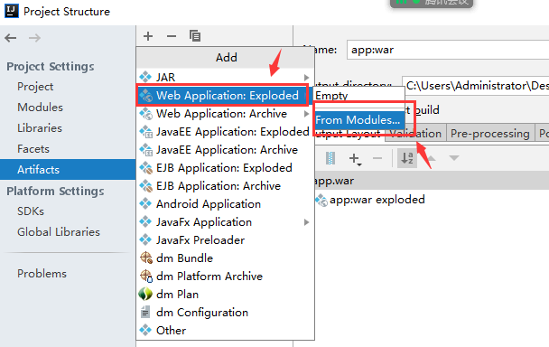

# 1.开发内容

- 提供接口数据给前端
- 开发自己管理平台

# 2.后端环境

- JDK8+；学习使用的开发环境
- Apache-Tomcat8/9，Web服务器，提供`Http/Https`协议服务
- MySQL5数据库；客户端工具（SQLyog / Navicat）；数据库设计建模工具（PowerDesigner）
- Maven工具 - 项目构建工具
- 远程源码管理仓库 + SVN（ *TortoiseSVN* ）
- 开发工具 - IDEA

# 3.Maven

*Maven*项目对象模型(POM)，可以通过一小段<u>**描述信息来管理项目的构建**</u>，报告和文档的项目管理工具软件

## 3.1 Maven环境

Maven版本 - 3.5 / 3.6

配置maven环境变量，添加 `MAVEN_HOME`


配置path环境变量，添加maven的bin目录


测试 maven 环境


## 3.2 Maven仓库

仓库里面存储关于我们开发相关的程序包。<u>**好处**</u>在于创建项目时候可以不用 `ctrl+c` 和 `ctrl+v` 进行程序包的复制；<u>**另一个好处追加依赖包**</u>，例如：一个项目里面需要 A.jar，但是A.jar --> B.jar。所以项目需要两个程序包，则maven可以自动把所需要第三方依赖包加入到项目里面

仓库：本地仓库 和 远程仓库

本地仓库默认路径 `.m2` 的目录，则可以根据自己的情况修改本地仓库路径

## 3.3 阿里云镜像

配置阿里云镜像，可以加速程序下载。注意去修改 maven 目录下 `conf/settings.xml`

```xml
<mirrors>
    <mirror>
      <id>alimaven</id> 
      <name>aliyun maven</name> 
      <url>http://maven.aliyun.com/nexus/content/groups/public/</url> 
      <mirrorOf>central</mirrorOf> 
    </mirror>
</mirrors>
```

## 3.4 创建maven项目

`maven-webapp` 项目支持web服务器开发

### 3.4.1 搭建maven-webapp骨架


### 3.4.2 项目目录结构

`maven-webapp` 工程结构

- src/main/java：源码目录
- src/main/webapp：web资源目录
- src/test/java：测试代码目录


### 3.4.3 配置tomcat

第一步：加载tomcat模板


第二步：创建项目artifact

将我们项目能够挂载tomcat里面




### 3.4.4 创建servlet

- Servlet是Java服务器端一个程序，支持接口开发。但是我们创建Java类需要继承`HttpServlet`

- 需要定义接口地址 `@WebServlet("/hello")`
- 创建对应请求方法 `doGet` 和 `doPost`

```xml
    <dependency>
      <groupId>javax.servlet</groupId>
      <artifactId>javax.servlet-api</artifactId>
      <version>3.1.0</version>
    </dependency>
```

```java
package com.app.controller.web;

import javax.servlet.ServletException;
import javax.servlet.annotation.WebServlet;
import javax.servlet.http.HttpServlet;
import javax.servlet.http.HttpServletRequest;
import javax.servlet.http.HttpServletResponse;
import java.io.IOException;

@WebServlet("/hello")
public class HelloController extends HttpServlet {
    @Override
    protected void doGet(HttpServletRequest req, HttpServletResponse resp) throws ServletException, IOException {
        System.out.println("---HelloController---");
    }
}
```

# 4.解读Servlet

## 4.1 B/S架构

浏览器与服务器开发方式


- 客户端 - 浏览器：HTML，JS，前端框架
- 服务器：JavaWeb；MVC框架；Spring；SpringBoot；SpringCloud；Redis；DFS；ZK；MQ
- 数据库：MySQL/Oracle（JDBC；Spring Jpa；MyBatis；Hibernate）

## 4.2 分层开发

理解MVC模式

- Model：数据模型 - 数据库中数据
- View：视图 - 前端开发技术
- Controller：控制器 - Servlet - Struts - SpringMVC - SpringBoot


## 4.3 数据展示

场景：将后台数据库中数据进行展示

目标达成：

- 了解前端技术，完成数据展示
- 编写数据展示接口，理解请求与响应的原理
- 实现对基础数据库操作


### 4.3.1 前端界面

```html
<!DOCTYPE html>
<html>
<head>
    <meta charset="utf-8">
    <style>
        .d-center {
            width: 1000px;
            height: 136px;
            display: flex;
            margin-bottom: 10px;
        }
        .d-pic {
            width: 250px;
            height: 136px;
        }
        .d-pic > img {
            width: 100%;
            height: 100%;
        }
        .d-txt {
            width: 750px;
            height: 136px;
        }
        .d-item > p:nth-of-type(1) {
            font-size: 20px;
        }
        .d-item > p:nth-of-type(2), .d-item > p:nth-of-type(3) {
            color: rgb(159,126,140);
            font-size: 16px;
        }
    </style>
</head>
<body>
<center>
    <h2>数据展示 - 后台管理平台</h2>
    <h2><button>查询数据</button></h2>
    <p></p>
    <div class="d-center">
        <div class="d-pic">
            
        </div>
        <div class="d-txt">
            <div class="d-item">
                <p>手游操作中的麦迪干拔姿势</p>
                <p>2020-06-29 18:36</p>
                <p>展现4288                    播放1669                    点赞4                    评论1</p>
            </div>
        </div>
    </div>

    <div class="d-center">
        <div class="d-pic">
            
        </div>
        <div class="d-txt">
            <div class="d-item">
                <p>手游操作中的麦迪干拔姿势</p>
                <p>2020-06-29 18:36</p>
                <p>展现4288                    播放1669                    点赞4                    评论1</p>
            </div>
        </div>
    </div>
</center>
</body>
</html>
```

### 4.3.2 前端JS

这次项目技术涉及JS，主要使用Ajax（`jQuery - JS库`）来对数据进行展示

- 发送请求，指向接口地址
- 发送请求参数给服务器
- 接收服务器返回数据
- 对网页进行数据渲染

```html
<script src='js/jquery-3.4.1.min.js'></script>
<script>
    // jQuery - 主函数
    // $ - jQuery 对象
	$(function() {
        // Ajax 语法
        $.ajax({
            url: '接口',
            dataType: 'json',
            method: 'GET',
            data: {key1:value1, key2:value2},
            success: function(e) {
                // 返回数据
            }
        });
    });
</script>
```

Ajax代码，测试请求到接口里面方法 - doGet方法

```html
<script src="js/jquery-3.4.1.min.js"></script>
<script>
    $(function() {  // jQuery主函数
        $.ajax({    // 网络请求
            url: 'http://localhost:8080/app/hello',
            method: 'GET',
            dataType: 'json',
            success: function(e) {
                console.log(e);
            }
        });
    });
</script>
```

### 4.3.3 后端json数据响应

服务器的响应 - json数据

第一步：加入jackson-databind.jar依赖

```xml
    <dependency>
      <groupId>com.fasterxml.jackson.core</groupId>
      <artifactId>jackson-databind</artifactId>
      <version>2.11.0</version>
    </dependency>
```

第二步：ObjectMapper类

- 进行json数据转换
- 怎么进行转换，可以将我们Java里面的对象 或 集合进行`json`数据转换
- `writeValueAsString(Object obj)`

第三步：PrintWriter类，Java里面IO流，用于服务器输出数据给客户端

```java
package com.app.controller.web;

import com.fasterxml.jackson.databind.ObjectMapper;

import javax.servlet.ServletException;
import javax.servlet.annotation.WebServlet;
import javax.servlet.http.HttpServlet;
import javax.servlet.http.HttpServletRequest;
import javax.servlet.http.HttpServletResponse;
import java.io.IOException;
import java.io.PrintWriter;
import java.util.HashMap;
import java.util.Map;

@WebServlet("/hello")
public class HelloController extends HttpServlet {
    @Override
    protected void doGet(HttpServletRequest req, HttpServletResponse resp) throws ServletException, IOException {
        // 1.设置中文编码
        // 2.设置响应类型
        // 3.生成json数据
        // 4.输出json数据

        resp.setCharacterEncoding("utf-8");
        resp.setContentType("text/plain;charset=utf-8");
        ObjectMapper objectMapper = new ObjectMapper(); // 解析Java对象, 生成json
        Map<String,Object> map = new HashMap<>();       // 存储数据
        map.put("code", 200);
        map.put("msg", "success");
        String s = objectMapper.writeValueAsString(map);

        PrintWriter out = resp.getWriter();
        out.println(s);
        out.close();
    }
}
```

### 4.3.4 数据库连接池

Java去操作数据库需要获取一个会话，会话尽量一次使用时候不断掉，然后也能够一次性给出多个会话。减少程序去创建会话时间

回顾JDBC操作

```xml
    <dependency>
      <groupId>mysql</groupId>
      <artifactId>mysql-connector-java</artifactId>
      <version>5.1.39</version>
    </dependency>
```


```java
package com.app;

import org.junit.Test;

import java.sql.Connection;
import java.sql.DatabaseMetaData;
import java.sql.DriverManager;
import java.sql.SQLException;

public class TestJdbc {
    // 设置数据库属性 用户名；用户密码；驱动；连接地址
    private String driver = "com.mysql.jdbc.Driver";
    private String url = "jdbc:mysql://localhost:3306/test"; //mysql5连接地址
    private String username = "root";
    private String password = "123456";

    // 加载驱动
    public TestJdbc() {
        try {
            Class.forName(driver);
        } catch (ClassNotFoundException e) {
            e.printStackTrace();
        }
    }

    // 获取连接
    @Test
    public void method1() throws SQLException {
        Connection conn = DriverManager.getConnection(url, username, password);
        DatabaseMetaData dmd = conn.getMetaData();
        String dbName = dmd.getDatabaseProductName();       // 数据库名
        String dbVersion = dmd.getDatabaseProductVersion(); // 数据库版本
        System.out.println(dbName + " " + dbVersion);
    }
}
```

介绍Druid连接池 - 阿里开源项目 - apache druid


```xml
 <dependency>
      <groupId>com.alibaba</groupId>
      <artifactId>druid</artifactId>
      <version>1.1.10</version>
 </dependency>
```

```properties
driverClassName=com.mysql.jdbc.Driver
url=jdbc:mysql:///test
username=root
password=123456

# 初始连接数
initialSize=5
# 最大连接数
maxActive=10
# 等待时间
maxWait=3000
```

```java
package com.app;

import com.alibaba.druid.pool.DruidDataSourceFactory;
import org.junit.Test;

import javax.sql.DataSource;
import java.io.IOException;
import java.io.InputStream;
import java.sql.Connection;
import java.sql.DatabaseMetaData;
import java.util.Properties;

public class TestDruid {

    // 测试数据库连接池
    @Test
    public void method1() throws Exception {
        Properties pro = new Properties(); // 读取配置文件的一个集合
        InputStream is = TestDruid.class.getClassLoader().getResourceAsStream("druid.properties");
        pro.load(is);
        DataSource ds = DruidDataSourceFactory.createDataSource(pro);
        Connection conn = ds.getConnection();
        DatabaseMetaData dmd = conn.getMetaData();
        String dbName = dmd.getDatabaseProductName();       // 数据库名
        String dbVersion = dmd.getDatabaseProductVersion(); // 数据库版本
        System.out.println(dbName + " " + dbVersion);
    }

}
```

开发Druid工具类 

```java
package com.app.utils;

import com.alibaba.druid.pool.DruidDataSourceFactory;

import javax.sql.DataSource;
import java.io.IOException;
import java.io.InputStream;
import java.sql.Connection;
import java.sql.SQLException;
import java.util.Properties;

// 设计模式 - 单例模式
public class DruidUtil {
    private static DataSource ds; // 数据源
    private static DruidUtil druidUtil; // 工具类对象

    // 静态代码块 - 建立druid连接池
    static {
        Properties properties = new Properties();
        InputStream is = DruidUtil.class.getClassLoader().getResourceAsStream("druid.properties");
        try {
            properties.load(is);
            ds = DruidDataSourceFactory.createDataSource(properties);
        } catch (IOException e) {
            e.printStackTrace();
        } catch (Exception e) {
            e.printStackTrace();
        }
    }

    private DruidUtil() {

    }

    public static DruidUtil getInstance() {
        if (druidUtil == null) {
            druidUtil = new DruidUtil();
        }
        return druidUtil;
    }

    public Connection getConnection() throws SQLException {
        if(ds == null) {
            return null;
        }
        return  ds.getConnection();
    }

    public void closeConnection(Connection conn) throws SQLException {
        if(conn != null) {
            conn.close();
        }
    }
}
```


### 4.3.5 数据库操作封装

原生JDBC数据查询 - 无条件查询

```java
    // 返回数据库中的数据
    // 返回ResultSet的结果集
    @Test
    public void method3() throws SQLException {
        Connection conn = null;         // 数据库连接
        PreparedStatement ps = null;    // 执行SQL语句接口
        ResultSet rs = null;            // 查询返回的结果
        String sql = null;              // SQL语句 - select

        conn = DruidUtil.getInstance().getConnection();
        sql = "select * from students";
        ps = conn.prepareStatement(sql);
        rs = ps.executeQuery();         // 执行查询操作

        while(rs.next()) {              // 取出数据
            String sName = rs.getString("sName");
            String sMajor = rs.getString("sMajor");
            System.out.println(sName + "  " + sMajor);
        }

        DruidUtil.getInstance().closeConnection(conn);
    }
```

原生JDBC数据查询 - 条件查询

```java
    // 条件查询
    @Test
    public void method4() throws SQLException {
        Connection conn = null;         // 数据库连接
        PreparedStatement ps = null;    // 执行SQL语句接口
        ResultSet rs = null;            // 查询返回的结果
        String sql = null;              // SQL语句 - select

        conn = DruidUtil.getInstance().getConnection();
        sql = "select * from students where sName = ? and sMajor = ?";
        ps = conn.prepareStatement(sql);    // 把SQL语句放入到内存
        ps.setString(1, "李四");
        ps.setString(2, "软件工程");

        rs = ps.executeQuery();
        while(rs.next()) {              // 取出数据
            String sName = rs.getString("sName");
            String sMajor = rs.getString("sMajor");
            System.out.println(sName + "  " + sMajor);
        }
        DruidUtil.getInstance().closeConnection(conn);
    }
```

### 4.3.6 业务逻辑

MVC开发思想 - 分层开发

- 控制器层 - 接口
- 业务逻辑 - 功能
- 数据访问层 - Dao - 数据库操作

```java
package com.app.service;

import java.sql.SQLException;
import java.util.List;

public interface HelloService {

    public List getStudentByList() throws SQLException;

}
```

```java
package com.app.service.impl;

import com.app.dao.HelloDao;
import com.app.dao.impl.HelloDaoImpl;
import com.app.service.HelloService;

import java.sql.SQLException;
import java.util.List;

public class HelloServiceImpl implements HelloService {

    private HelloDao helloDao = new HelloDaoImpl();

    @Override
    public List getStudentByList() throws SQLException {
        return helloDao.getStudentByList();
    }

}
```


### 4.3.7 返回接口数据

dao层代码

```java
package com.app.dao;

import java.sql.SQLException;
import java.util.List;

public interface HelloDao {
    List getStudentByList() throws SQLException;
}
```

```java
package com.app.dao.impl;

import com.app.dao.HelloDao;
import com.app.utils.DruidUtil;

import java.sql.Connection;
import java.sql.PreparedStatement;
import java.sql.ResultSet;
import java.sql.SQLException;
import java.util.ArrayList;
import java.util.HashMap;
import java.util.List;
import java.util.Map;

public class HelloDaoImpl implements HelloDao {

    @Override
    public List getStudentByList() throws SQLException {
        Connection conn = null;         // 数据库连接
        PreparedStatement ps = null;    // 执行SQL语句接口
        ResultSet rs = null;            // 查询返回的结果
        String sql = null;              // SQL语句 - select
        List list = new ArrayList();    // 集合存储数据

        conn = DruidUtil.getInstance().getConnection();
        sql = "select * from students";
        ps = conn.prepareStatement(sql);
        rs = ps.executeQuery();         // 执行查询操作

        while(rs.next()) {              // 取出数据
            String sName = rs.getString("sName");
            String sMajor = rs.getString("sMajor");
            String sSex = rs.getString("sSex");
            Map<String, Object> map = new HashMap<>();
            map.put("sName", sName);
            map.put("sMajor", sMajor);
            map.put("sSex", sSex);
            list.add(map);              // 满足存储 - 数据格式 [{}, {}, {}, {}]
        }

        DruidUtil.getInstance().closeConnection(conn);
        return list;
    }

}
```

